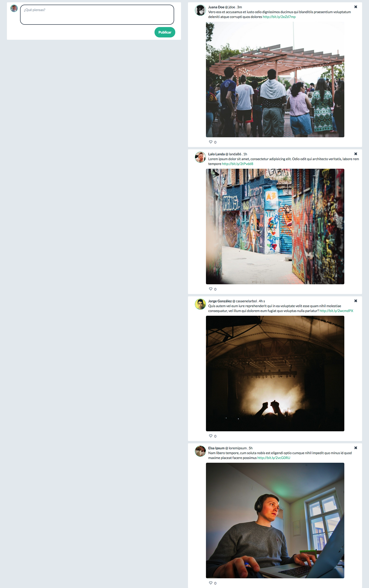

# Actividad 2 de la Segunda Semana de JQuery

Para la siguiente actividad clona este repositorio y trabaja en cada una de las carpetas respectivas.

Revisa el archivo [readme](./readme.md), el cual contiene toda la información relevante para poder realizar el ejercicio.

## Instrucciones

Se pide construir una plataforma tipo *Twitter* de un sólo usuario.

#### Requisitos:

Utilizando sistema de *grids* se debe dividir el viewport en **2 columnas** (Se recomienda Bootstrap):

- En la columna de la izquierda:
    -   Crear un campo de texto donde el usuario pueda ingresar el texto del *tweet* y un botón para confirmar la creación.
- En la columna de la derecha:
    - Los *tweets* deben ser enlistados en bloques. *(Cada tweet un nuevo row)*
- Cada *tweet* de la lista debe tener a su lado un link que contenga un icono (❤️) para dar *like*, un contador de likes (por defecto es cero) y un botón para eliminar el *tweet*.
    - *Se recomienda usar Font Awesome para los iconos*.
- El link del icono (❤️) debe dar like al *tweet*. Al hacer esto el icono debe cambiar de color y el contador de *likes* -de ese tweet- debe aumentar en uno.
- El link del icono (❤️) debe tener una clase **likeable**. (jQuery)
- Seleccionar con JQuery la clase *likeable* y agregar el evento **click** para aumentar el contador en uno.
- El botón de eliminar debe remover el *tweet* de la lista.
